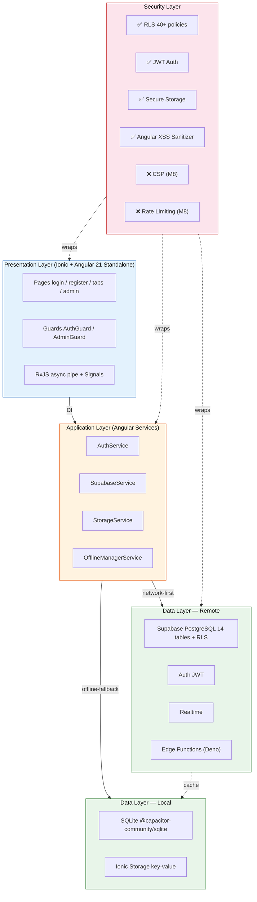

# UniHub - Architecture Decision Records (ADR)

## 1. ¿Por qué Ionic + Angular en vez de Kotlin nativo?

| Criterio | Ionic + Angular | Kotlin + Jetpack Compose |
|----------|----------------|--------------------------|
| Plataformas | Web + iOS + Android (1 codebase) | Solo Android |
| Lenguaje | TypeScript (más desarrolladores) | Kotlin (más nicho) |
| Curva de aprendizaje | Web devs pueden contribuir rápido | Requiere conocimiento Android |
| Tiempo de desarrollo | ~30% más rápido (hot reload, web) | Compilación nativa más lenta |
| UI | Ionic web components (CSS variables) | Compose declarativo |
| Acceso nativo | Capacitor plugins (cámara, GPS, etc.) | SDK nativo directo |
| PWA | Nativo (Service Worker) | No disponible |
| Performance | Buena para apps CRUD/dashboard | Excelente para apps gráficas intensivas |
| App Stores | Play Store + App Store | Solo Play Store |
| CI | npm build, simple | Gradle, más complejo |

**Decisión**: Ionic + Angular porque UniHub es una app de contenido (CRUD, formularios, dashboards) donde el rendimiento nativo no es crítico. Beneficio principal: **un solo codebase → web, iOS y Android**. Además, el stack TypeScript se integra naturalmente con Supabase JS SDK y Edge Functions Deno (ambos TypeScript), unificando el lenguaje en frontend y backend.

### ¿Por qué Angular y no React o Vue para Ionic?

| Criterio | Angular | React | Vue |
|----------|---------|-------|-----|
| TypeScript | Nativo, first-class | Requiere configuración | Soporte parcial |
| DI | Incorporado (no necesita librería extra) | Necesita contexto o librería | Necesita plugin |
| Estructura | Opinado, bueno para equipos | Flexible (caos en equipos grandes) | Punto medio |
| RxJS | Nativo (reactive state) | Necesita RxJS aparte | Necesita librería |
| Ionic compatibility | Excelente (equipo Ionic usa Angular internamente) | Bueno | Bueno |
| Testing | Jasmine + TestBed incluido | Jest + RTL | Vitest |

**Decisión**: Angular por su estructura opinada que previene decisiones erráticas en equipos, DI nativo que reemplaza a Hilt sin configuración extra, y RxJS integrado para manejar streams de Supabase Realtime.

## 2. ¿Por qué Supabase y no Firebase?

| Criterio | Supabase | Firebase |
|----------|----------|----------|
| Base de datos | PostgreSQL relacional | Firestore NoSQL |
| Auth | JWT estándar + RLS integrado | Auth propietario |
| Realtime | PostgreSQL WAL replication | Firestore listeners |
| Edge Functions | Deno TypeScript | Google Cloud Functions |
| SQL migraciones | Versionado con CLI | No disponible |
| Open source | Sí (self-hosted posible) | No |
| Costo | Predictible, basado en DB size | Impredecible a escala |

**Decisión**: Supabase porque el dominio universitario es relacional (estudiantes, encuestas, aulas, eventos con JOINs). RLS delega autorización a la DB. Y el CLI `supabase` permite desarrollo local con `supabase start`.

## 3. Patrón de Arquitectura: Services + Repository

### Diagrama de capas (Mermaid)



### Diagrama ASCII (alternativa portable)

```
┌──────────────────────────────────────────────────────┐
│  Presentation Layer                                 │

**Principios**:
- **Unidirectional Data Flow**: Service → BehaviorSubject → async pipe → template
- **Single source of truth**: El Service decide si devolver datos de Supabase o cache local
- **Separation of concerns**: Pages no saben de HTTP ni SQLite; Services no saben de Ionic Components

## 4. Estrategia de Cache Offline

```
1. Page pide datos al Service
2. Service devuelve cache SQLite inmediatamente (si existe)
3. Service hace fetch a Supabase en paralelo
4. Si Supabase responde: actualiza SQLite, emite nuevo dato vía BehaviorSubject
5. Si Supabase falla: emite error, pero Page ya tiene cache → usable
6. Mutaciones (POST/PUT/DELETE): se intenta Supabase primero, si falla → cola offline
7. Service Worker (PWA): cachea assets (JS, CSS, imágenes) para carga offline
```

- **SQLite** (via `@capacitor-community/sqlite`): announcements, notices, events (últimos 30 días), FAQ entries
- **Ionic Storage** (key-value): user preferences, auth token, last sync timestamp
- **No se cachea**: survey_responses (siempre frescos), help_queries (efímeros)
- **PWA Service Worker**: precache de shell (navbar, tabs, fonts) y runtime cache de API calls

## 5. Seguridad en Capas

### Diagrama de seguridad (Mermaid)

```mermaid
flowchart LR
    subgraph Client["Client Layer"]
        CSP["CSP Content Security Policy"]
        Sanitizer["Angular XSS Sanitizer"]
        SecureToken["Ionic Secure Storage tokens"]
        HSTS["HTTPS + HSTS"]
    end

    subgraph Transport["Transport Layer"]
        TLS["HTTPS TLS 1.3"]
        JWT["JWT in Authorization header"]
    end

    subgraph Gateway["API Gateway (Supabase)"]
        JWTVal["JWT Validation"]
        CORS["CORS Whitelist"]
        Rate["Rate Limiting"]
    end

    subgraph Database["Database Layer (PostgreSQL)"]
        RLS["Row Level Security"]
        PrepStmt["Prepared Statements"]
        PITR["Point-in-Time Recovery"]
    end

    Client --> Transport --> Gateway --> Database
```


│                │  Angular sanitizer (XSS)
│                │  Ionic Secure Storage (tokens)
│                │  HTTPS + HSTS
├────────────────┤
│  Transport     │  HTTPS (TLS 1.3)
│                │  JWT en Authorization header
├────────────────┤
│  API Gateway   │  Supabase Auth (JWT validation)
│                │  Rate Limiting (Edge Functions)
│                │  CORS whitelist
├────────────────┤
│  Database      │  Row Level Security (RLS)
│                │  Prepared statements (SQL injection)
│                │  Point-in-time recovery (backups)
└────────────────┘
```

## 6. Convenciones de Código

### TypeScript / Angular 21
- `kebab-case` para archivos y selectores: `auth-service.ts`, `app-login-page`
- `camelCase` para variables, funciones, métodos
- `PascalCase` para clases, interfaces, tipos
- `UPPER_SNAKE_CASE` para constantes de entorno
- Sufijos: `Page`, `Component`, `Service`, `Pipe`, `Guard`, `Interceptor`
- Estructura por feature: `src/app/pages/[feature]/[feature].page.ts`

### SQL
- `snake_case` para tablas y columnas
- Plural para tablas: `profiles`, `announcements`, `surveys`
- Singular para claves foráneas: `created_by`, `survey_id`
- Migraciones numeradas: `00001_initial_schema.sql`

### Edge Functions (Deno TypeScript)
- Runtime Deno 2.x
- Un archivo por función: `notify-on-announcement/index.ts`
- Tests con `deno test`
- 1/4 implementada: `validate-student-code` ✅

## 7. Testing Strategy

| Nivel | Framework | Alcance | % Objetivo |
|-------|-----------|---------|------------|
| Unit | Jest | Services, Pipes, Guards, Edge Functions | 50% |
| Component | Jasmine + Ionic Test | Pages, Components, Directives | 15% |
| Integration | Jest + Supabase mock | Service + Storage + Supabase | 30% |
| E2E | Playwright | Flujos críticos (web + mobile viewport) | 5% |
| Accessibility | axe-core + Lighthouse | WCAG 2.1 AA | obligatorio |

## 8. Performance Targets

| Métrica | Objetivo |
|---------|----------|
| First Contentful Paint (PWA) | < 1.5s |
| Time to Interactive | < 3s |
| API response (P95) | < 3s |
| Offline availability | 100% (cache + PWA) |
| Lighthouse Score | > 90 |
| PWA Installability | Pass |
| Bundle size (gzipped) | < 500KB |

