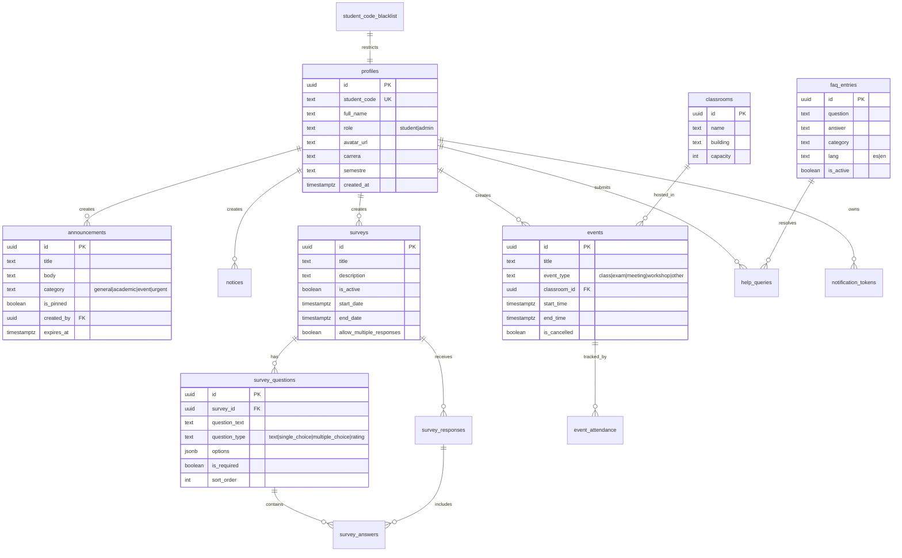

# UniHub - Database Schema (PostgreSQL via Supabase)

> Este schema es independiente del frontend. Funciona igual con Ionic/Angular, React, o Kotlin.

## Diagrama de Relaciones (Mermaid ERD)



## Extensiones Requeridas

```sql
CREATE EXTENSION IF NOT EXISTS "uuid-ossp";
CREATE EXTENSION IF NOT EXISTS "pg_trgm";
CREATE EXTENSION IF NOT EXISTS "btree_gist";  -- para exclusión GIST en events
```

## Tablas

### profiles ✅
- `id` UUID PK (references auth.users, CASCADE)
- `student_code` TEXT UNIQUE NOT NULL
- `full_name` TEXT NOT NULL
- `role` TEXT CHECK (student|admin) DEFAULT 'student'
- `avatar_url` TEXT
- `carrera` TEXT (carrera universitaria)
- `semestre` TEXT (semestre actual)
- `created_at` TIMESTAMPTZ DEFAULT now()
- `updated_at` TIMESTAMPTZ DEFAULT now()
- **Indexes**: `role`, `student_code`
- **Estado**: ✅ Implementado en schema y código

### announcements
- `id` UUID PK DEFAULT uuid_generate_v4()
- `title` TEXT NOT NULL
- `body` TEXT NOT NULL
- `category` TEXT CHECK (general|academic|event|urgent) DEFAULT 'general'
- `is_pinned` BOOLEAN DEFAULT false
- `created_by` UUID FK → profiles (SET NULL)
- `expires_at` TIMESTAMPTZ
- `created_at`, `updated_at` TIMESTAMPTZ
- **Indexes**: `category`, `created_at DESC`, `expires_at`, `is_pinned` (partial)

### notices
- `id` UUID PK, `title` TEXT NOT NULL, `content` TEXT NOT NULL
- `priority` TEXT CHECK (low|medium|high) DEFAULT 'medium'
- `is_active` BOOLEAN DEFAULT true
- `created_by` UUID FK → profiles (SET NULL)
- `created_at`, `updated_at` TIMESTAMPTZ
- **Indexes**: `priority`, `is_active` (partial)

### surveys
- `id` UUID PK, `title` TEXT NOT NULL, `description` TEXT
- `is_active` BOOLEAN DEFAULT true
- `start_date`, `end_date` TIMESTAMPTZ
- `allow_multiple_responses` BOOLEAN DEFAULT false
- `created_by` UUID FK → profiles (SET NULL)
- `created_at`, `updated_at` TIMESTAMPTZ
- **Indexes**: `is_active` (partial), `end_date` (partial)

### survey_questions
- `id` UUID PK, `survey_id` UUID FK → surveys (CASCADE) NOT NULL
- `question_text` TEXT NOT NULL
- `question_type` TEXT CHECK (text|single_choice|multiple_choice|rating)
- `options` JSONB — ej: `["Opción A", "Opción B"]`
- `is_required` BOOLEAN DEFAULT true, `sort_order` INT DEFAULT 0
- **Indexes**: `(survey_id, sort_order)`

### survey_responses
- `id` UUID PK, `survey_id` UUID FK → surveys (CASCADE) NOT NULL
- `user_id` UUID FK → profiles (CASCADE) NOT NULL
- `submitted_at` TIMESTAMPTZ DEFAULT now()
- **UNIQUE(survey_id, user_id)** — una respuesta por usuario por encuesta
- **CHECK constraint**: la encuesta debe estar activa y dentro de fechas
- **Indexes**: `survey_id`, `user_id`

### survey_answers
- `id` UUID PK, `response_id` UUID FK → survey_responses (CASCADE) NOT NULL
- `question_id` UUID FK → survey_questions (CASCADE) NOT NULL
- `answer_text` TEXT
- `answer_options` JSONB — opciones seleccionadas para multiple_choice
- `answer_rating` INT CHECK (1-5)
- **UNIQUE(response_id, question_id)** — una respuesta por pregunta
- **Indexes**: `response_id`, `question_id`

### classrooms
- `id` UUID PK, `name` TEXT NOT NULL, `building` TEXT
- `capacity` INT CHECK (> 0), `resources` JSONB
- `is_active` BOOLEAN DEFAULT true
- `created_at`, `updated_at` TIMESTAMPTZ

### events
- `id` UUID PK, `title` TEXT NOT NULL, `description` TEXT
- `event_type` TEXT CHECK (class|exam|meeting|workshop|other) DEFAULT 'other'
- `classroom_id` UUID FK → classrooms (SET NULL)
- `professor_id` UUID FK → profiles (SET NULL)
- `start_time`, `end_time` TIMESTAMPTZ NOT NULL
- `recurring_rule` TEXT — formato RRULE
- `color` TEXT DEFAULT '#3B82F6'
- `is_cancelled` BOOLEAN DEFAULT false
- `created_by` UUID FK → profiles (SET NULL)
- `created_at`, `updated_at` TIMESTAMPTZ
- **CONSTRAINT check**: `end_time > start_time`
- **EXCLUDE GIST**: no solapamiento de eventos en misma aula
- **Indexes**: `start_time`, `classroom_id`, `professor_id`, `(start_time, end_time)`

### faq_entries
- `id` UUID PK, `question` TEXT NOT NULL, `answer` TEXT NOT NULL
- `category` TEXT, `sort_order` INT DEFAULT 0, `is_active` BOOLEAN DEFAULT true
- `created_at`, `updated_at` TIMESTAMPTZ
- **Indexes**: GIN full-text search (`to_tsvector('spanish', ...)`), trigram, `is_active` (partial)

### help_queries
- `id` UUID PK, `user_id` UUID FK → profiles (SET NULL)
- `query_text` TEXT NOT NULL, `matched_faq_id` UUID FK → faq_entries (SET NULL)
- `resolved` BOOLEAN DEFAULT false
- `created_at` TIMESTAMPTZ DEFAULT now()
- **Indexes**: `user_id`, `resolved`

### notification_tokens
- `id` UUID PK, `user_id` UUID FK → profiles (CASCADE) NOT NULL
- `fcm_token` TEXT NOT NULL
- `device_info` TEXT
- `is_active` BOOLEAN DEFAULT true
- **UNIQUE(user_id, fcm_token)**
- `created_at`, `updated_at` TIMESTAMPTZ

### student_code_blacklist
- `id` UUID PK, `student_code` TEXT UNIQUE NOT NULL
- `reason` TEXT
- `created_at` TIMESTAMPTZ DEFAULT now()

### survey_results_cache
- `id` UUID PK, `survey_id` UUID FK → surveys (CASCADE) NOT NULL
- `results` JSONB NOT NULL
- `generated_at` TIMESTAMPTZ DEFAULT now()
- `expires_at` TIMESTAMPTZ DEFAULT (now() + 1 hour)

---

## Triggers

Tablas con `updated_at` tienen trigger `BEFORE UPDATE` que actualiza el timestamp automáticamente: `profiles`, `announcements`, `notices`, `surveys`, `classrooms`, `events`, `faq_entries`, `notification_tokens`.

---

## Row Level Security

Todas las tablas tienen RLS habilitado. Políticas completas en `supabase/migrations/00002_rls_policies.sql`.

| Tabla | Student | Admin |
|-------|---------|-------|
| profiles | SELECT/UPDATE own | SELECT/UPDATE all |
| announcements | SELECT active + no expirados | CRUD all |
| notices | SELECT active | CRUD all |
| surveys | SELECT active + en rango de fechas | CRUD all |
| survey_questions | SELECT via survey activa | CRUD all |
| survey_responses | INSERT own, SELECT own | SELECT all |
| survey_answers | INSERT via own response, SELECT own | SELECT all |
| classrooms | SELECT active | CRUD all |
| events | SELECT no cancelados | CRUD all |
| faq_entries | SELECT active | CRUD all |
| help_queries | INSERT own, SELECT own | SELECT/UPDATE all |
| notification_tokens | INSERT/UPDATE/DELETE own, SELECT own | SELECT all |
| student_code_blacklist | — | CRUD all |
| survey_results_cache | SELECT via survey activa | CRUD all |

### Mejoras respecto al diseño original

1. **`expires_at` en RLS**: Los estudiantes ya no ven anuncios expirados
2. **`is_active` en notices**: Solo avisos activos
3. **`is_active` en classrooms**: Solo aulas activas
4. **`is_active` en faq_entries**: Solo FAQs activas
5. **`is_cancelled` en events**: Eventos cancelados ocultos
6. **`is_active` + rango de fechas en surveys**: Validación en RLS y CHECK constraint
7. **Tablas nuevas**: `notification_tokens`, `student_code_blacklist`, `survey_results_cache`
